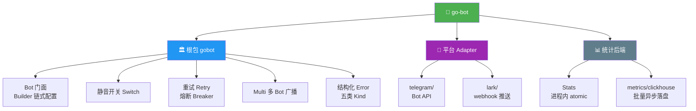

<div align="center">

# 🤖 Go-Bot

**多平台机器人消息 SDK**

*一次接入，统一 API 发送 Telegram / Lark（飞书），重试、静音、统计等通用能力一次暴露，新平台即插即用*

<br>

[](https://github.com/kamalyes/go-bot)
[](LICENSE)
[](https://golang.org/)
[](https://goreportcard.com/report/github.com/kamalyes/go-bot)
[](https://pkg.go.dev/github.com/kamalyes/go-bot)

<br>

*[🚀 快速开始](#-快速开始)* · *[📋 API 速查表](#-api-速查表)* · *[🧰 模块一览](#-模块一览)* · *[📊 平台适配对照](#-平台适配对照)*

</div>

---

## ✨ 特性亮点

- 🚀 **统一 API** - `bot.Send(ctx, target, msg)` 一套代码发送所有平台，新平台实现 `Adapter` SPI 即自动获得全部通用能力
- 🔌 **平台即插即用** - `telegram/`（Bot API）与 `lark/`（自定义机器人 webhook）独立子包，引入哪个平台才有哪些依赖
- 🔁 **自动重试** - go-toolbox/retry 驱动（指数退避 + jitter），仅重试可重试错误（429/5xx/平台限流码），尊重 Retry-After
- 🛡️ **熔断保护** - 可选 go-toolbox/breaker，连续失败达到阈值后快速失败，避免对故障平台持续压测
- 🔕 **运行期静音** - Switch 开关一键止言，静音丢弃不计入成功率
- 📊 **双路统计** - 进程内 atomic 计数（sent/error/muted/成功率）始终可用，可选 ClickHouse 持久化每条发送事件
- ⚡ **异步落盘** - ClickHouse 统计走 `syncx.BatchProcessor` 批量聚合，队列满即丢，绝不阻塞发送主流程
- ❌ **结构化错误** - `*gobot.Error` 五类 Kind（validation/transport/http/platform/decode）+ Retryable，无需匹配错误字符串
- 🎯 **链式构造** - `gobot.Text("...").AtAll()` Builder 风格，对齐 go-logger / go-cachex 使用习惯
- 📣 **多平台广播** - `NewMulti(bot1, bot2)` 并发扇出、聚合错误
- 💬 **TG 群组能力** - `ListChats` / `GetChat` / `LeaveChat` 群管理基础能力，`GetEvents` 长轮询收事件
- 🧱 **业务与 SDK 分离** - 只提供平台基础能力，绑定/解绑/订阅等业务语义由调用方实现

## 🏗️ 架构概览



发送流水线（全部在根包核心层，adapter 无感知）：

```
Send → 校验 → Switch 静音？ → Retry / Breaker → Adapter.Send → Stats(atomic) + Metrics(可选)
```

## 🚀 快速开始

### 安装

```bash
go get github.com/kamalyes/go-bot
```

### Telegram（Bot API）

```go
package main

import (
    "context"

    gobot "github.com/kamalyes/go-bot"
    "github.com/kamalyes/go-bot/telegram"
)

func main() {
    adapter, err := telegram.New(telegram.Config{Token: "123456:ABC-DEF..."})
    if err != nil {
        panic(err)
    }

    bot, err := gobot.NewBot(adapter).
        WithRetry(gobot.RetryPolicy{MaxRetries: 3, Jitter: true}).
        Build()
    if err != nil {
        panic(err)
    }
    defer bot.Close(context.Background())

    // 发送文本（@ 全员）
    _, err = bot.Send(context.Background(), gobot.Chat("-1001234567890"),
        gobot.Text("部署完成 ✅").AtAll())

    // 发送 markdown 告警（@ 指定用户）
    _, err = bot.Send(context.Background(), gobot.Chat("-1001234567890"),
        gobot.Markdown("告警", "**CPU 90%**").AtUsers("123456789"))
}
```

群组能力与事件接收（TG 特有）：

```go
// 拉取平台事件（长轮询），业务在 Event.Message.Text 匹配指令
events, err := adapter.GetEvents(ctx, telegram.EventOptions{Timeout: 30})

// 会话列表（从事件中自动积累）
chats, err := adapter.ListChats(ctx)

// 查询会话详情 / 退出会话
chat, err := adapter.GetChat(ctx, "-1001234567890")
err = adapter.LeaveChat(ctx, "-1001234567890")
```

### Lark（自定义机器人 webhook）

```go
adapter, err := lark.New(lark.Config{
    Token:  "webhook-token",           // 推送地址最后一段
    Secret: "optional-sign-secret",   // 开启签名校验后必填，可省略
})

bot, err := gobot.NewBot(adapter).Build()

// webhook 固定投递到机器人所在会话，Target 不参与路由
_, err = bot.Send(context.Background(), gobot.Chat(""),
    gobot.Markdown("告警", "**磁盘 95%**"))
```

### ClickHouse 统计（可选）

gorm 连接由接入方自建并管理生命周期（clickhouse-go OpenDB 注入 gorm 驱动，与 dashboard 服务同一模式）：

```go
// 建连（接入方负责，连接池随 Options 生效）
sqlDB := ch.OpenDB(&ch.Options{
    Addr: []string{"127.0.0.1:9000"},
    Auth: ch.Auth{Database: "default", Username: "default", Password: "secret"},
})
db, err := gorm.Open(gormch.New(gormch.Config{Conn: sqlDB}), &gorm.Config{})
if err != nil {
    panic(err)
}

chMetrics, err := clickhouse.New(db, clickhouse.Config{}) // 表名/批量参数可选
if err != nil {
    panic(err)
}
defer chMetrics.Stop() // 落盘剩余事件；连接池归接入方管理

bot, err := gobot.NewBot(adapter).
    WithMetrics(chMetrics). // 不配则无持久化统计
    Build()

// 进程内统计始终可用
fmt.Println(bot.Stats().SuccessRate())
```

统计事件批量异步写入 `bot_send_events` 表（建表语句见 `metrics/clickhouse/schema.sql`），常用查询：

```sql
-- 发送量
SELECT platform, count() FROM bot_send_events GROUP BY platform;
-- 成功率
SELECT platform, sum(success) / count() FROM bot_send_events GROUP BY platform;
```

### 多平台广播

```go
multi, err := gobot.NewMulti(tgBot, larkBot)

// 并发扇出到所有平台，聚合错误
_, err = multi.Send(ctx, target, gobot.Text("全平台通知"))
```

## 📋 API 速查表

| API | 签名 | 说明 |
|-----|------|------|
| `NewBot` | `NewBot(adapter Adapter) *BotBuilder` | 组装 Bot（Builder 链式） |
| `WithLogger` | `WithLogger(l ILogger) *BotBuilder` | 日志（默认 EmptyLogger） |
| `WithRetry` | `WithRetry(p RetryPolicy) *BotBuilder` | 重试策略 |
| `WithSwitch` | `WithSwitch(s *Switch) *BotBuilder` | 静音开关 |
| `WithMetrics` | `WithMetrics(m Metrics) *BotBuilder` | 统计后端（默认 EmptyMetrics） |
| `WithName` | `WithName(name string) *BotBuilder` | Bot 标识（默认平台名） |
| `WithBreaker` | `WithBreaker(c *breaker.Circuit) *BotBuilder` | 熔断器（可选） |
| `Text` | `Text(text string) *Message` | 文本消息 |
| `Markdown` | `Markdown(title, content string) *Message` | Markdown 消息 |
| `Image` | `Image(url string) *Message` | 图片消息 |
| `AtAll` / `AtUsers` | `(*Message) *Message` | @ 全员 / @ 指定用户 |
| `User` / `Chat` | `User(id) / Chat(id) Target` | 发送目标 |
| `Send` | `Send(ctx, target, msg) (*SendResult, error)` | 统一发送入口 |
| `SendText` / `SendMarkdown` / `SendImage` | `(ctx, target, ...) (...)` | 便捷发送 |
| `Stats` | `Stats() *Stats` | 进程内统计（sent/error/muted/成功率） |
| `NewMulti` | `NewMulti(bots ...*Bot) (*Multi, error)` | 多 Bot 并发广播 |

## 🧰 模块一览

| 模块 | 文件 | 功能描述 | 使用场景 |
|------|------|----------|----------|
| 🏛️ Bot 门面 | [bot.go](bot.go) | Builder 链式配置 + 发送流水线 | **统一入口** |
| 🔌 Adapter SPI | [adapter.go](adapter.go) | Platform / Send / Close 三方法契约 | 新平台接入 |
| 📨 消息模型 | [message.go](message.go) | Text/Markdown/Image + @ 提及 | 消息构造 |
| 🎯 发送目标 | [target.go](target.go) | Target{ID, Type(user/chat)} | 目标路由 |
| ⚙️ 常量 | [constants.go](constants.go) | 平台标识、默认超时/退避 | 默认值 |
| ❌ 错误体系 | [errors.go](errors.go) | 结构化 *Error（Kind + Retryable） | 错误分支处理 |
| 🔁 重试 | [retry.go](retry.go) | 指数退避 + Retry-After 尊重 + jitter | 失败恢复 |
| 🔕 静音开关 | [switch.go](switch.go) | 运行期止言 | 一键禁发 |
| 📊 进程内统计 | [stats.go](stats.go) | atomic sent/error/muted/成功率 | 始终可用 |
| 📈 统计接口 | [metrics.go](metrics.go) | Metrics 接口 + SendStat + EmptyMetrics | 持久化扩展点 |
| 📣 多 Bot 广播 | [multi.go](multi.go) | 并发扇出、聚合错误 | 多平台通知 |

### telegram/

| 文件 | 功能描述 |
|------|----------|
| [telegram.go](telegram/telegram.go) | 构造与配置（Config/Adapter/New） |
| [send.go](telegram/send.go) | 发送（sendMessage/sendPhoto） |
| [payload.go](telegram/payload.go) | 消息体渲染（text/markdown/@ 提及，HTML 转义） |
| [api.go](telegram/api.go) | HTTP 基础设施（callAPI 泛型调用、429 退避、可重试判定） |
| [chat.go](telegram/chat.go) | 群组能力（ListChats/GetChat/LeaveChat，会话自动积累） |
| [events.go](telegram/events.go) | 事件接收（GetEvents 长轮询 + Event/ChatMessage 模型） |

### lark/

| 文件 | 功能描述 |
|------|----------|
| [lark.go](lark/lark.go) | 构造与配置（Config/Adapter/New + 业务码常量） |
| [send.go](lark/send.go) | webhook 推送与响应解码 |
| [sign.go](lark/sign.go) | 请求签名（HMAC-SHA256） |
| [payload.go](lark/payload.go) | 消息体构造（@ 提及渲染 + markdown 卡片组装） |

### metrics/clickhouse/

| 文件 | 功能描述 |
|------|----------|
| [clickhouse.go](metrics/clickhouse/clickhouse.go) | 构造与配置（注入接入方 gorm 连接，BatchProcessor 驱动异步批量） |
| [insert.go](metrics/clickhouse/insert.go) | 批量写入（参数化 INSERT VALUES） |
| [schema.sql](metrics/clickhouse/schema.sql) | bot_send_events 建表语句 |

## 📊 平台适配对照

| | telegram/ | lark/ |
| --- | --- | --- |
| 形态 | Bot API（长轮询） | 自定义机器人 webhook 推送 |
| 凭据 | Bot Token | webhook Token + 可选签名 Secret |
| text | sendMessage | `msg_type=text` 直发 |
| markdown | sendMessage（parse_mode 可配） | interactive 卡片 + markdown 元素 |
| image | sendPhoto(URL) | 不支持（返回校验错误） |
| @ 提及 | `tg://user?id=`（HTML 转义） | `<at user_id=...></at>`（all 为保留字） |
| 限流响应 | 429 + retry_after | 业务码 11232，转 Retryable |
| 路由 | 按 Target.ID 投递 | 固定投递机器人所在会话 |
| 群组能力 | ListChats / GetChat / LeaveChat | 无 |
| 事件 | GetEvents 长轮询 | 无（单向推送） |
| 约束 | bot 无法主动加群，只能被拉入 | 请求体上限 20KB（本地拦截）、签名 1 小时内有效 |

> 💡 后续接入腾讯系（企业微信等）：新增 `wecom/` 子包实现 Adapter 即可，核心不动

## 🧪 测试

```bash
# 运行全部测试
go test ./...

# 运行指定包测试
go test ./telegram/ -v
```

## 📄 许可证

Copyright (c) 2026 kamalyes. All Rights Reserved.
